# 🔋 EV Battery SOH Prediction Web App

A powerful Django-based web application to **predict the State of Health (SOH)** of electric vehicle batteries using **machine learning (LightGBM)**.  
Includes a complete **authentication system**, rich **battery insights**, and a **downloadable report**.

---

## 🌟 Project Highlights

- 📌 Predict SOH using 10 EV battery parameters
- ✅ User Register/Login with email OTP verification
- 🔒 Forgot password system with secure OTP reset
- 📊 Dynamic result dashboard with charts and metrics
- 📥 Download battery report as PDF (via JS/HTML)

---

## 🎯 Objective

As battery degradation directly impacts EV safety and performance, predicting the **State of Health (SOH)** enables:

- 🔧 Predictive maintenance
- 🛡️ Failure prevention
- 📉 Cost optimization
- 🔋 Battery lifecycle analysis

---

## 🧪 Input Features (Frontend Form)

| Feature              | HTML ID              | Ideal Range         |
|----------------------|----------------------|---------------------|
| Model Year           | `model-year`         | 2012 – 2025         |
| Motor Power (kW)     | `motor-power`        | 35 – 829            |
| Range (km)           | `range`              | 92 – 837            |
| Terminal Voltage (V) | `voltage`            | 3.0 – 5.0           |
| Terminal Current (A) | `current`            | -3 – 1              |
| Temperature (°C)     | `temperature`        | 20 – 45             |
| Charge Current (A)   | `charge-current`     | -2 – 2              |
| Charge Voltage (V)   | `charge-voltage`     | 0 – 5               |
| Battery Capacity     | `capacity`           | 1.2 – 2             |
| Battery Cycle Count  | `cycle`              | 1 – 1000            |

---

## 🧠 Deep Learning Model

🔍 **Algorithm:** LightGBM (Gradient Boosting framework)

📂 **Trained Model Path:**

```python
MODEL_PATH = r"F:\ev_battery\ev_django\battery_health\models\lgbm_soh_model.pkl"
```
---


📊 **Input Features:**

- Model_Year  
- Motor_(kW)  
- Range_(km)  
- terminal_voltage  
- terminal_current  
- temperature  
- charge_current  
- charge_voltage  
- capacity  
- cycle  

📈 **Output:**

- Predicted **SOH** as a float value (scaled between **1 to 100**)
---

## 🔐 Authentication System

Your application includes a full authentication workflow with:

- ✅ **User Registration** – `register.html`
- ✅ **Login Page** – `login.html`
- ✅ **OTP Verification** – `verify_otp.html` (activation by email)
- ✅ **Forgot Password** – `password_reset.html` (reset via OTP)

---

## 📊 Battery Analysis Report (Output Results)


After submitting the EV battery form, the app dynamically computes and shows the following metrics:

| Metric                        | Description                                                   |
|------------------------------|---------------------------------------------------------------|
| 🔋 **Predicted SOH**         | Main output showing battery State of Health                   |
| ⭐ **Performance Score (/100)** | Based on model prediction quality                             |
| ⏳ **Battery Life Estimate** | Approximate remaining lifespan in years                       |
| 🚨 **Risk Assessment**       | Displays warnings if health is critical                       |
| ⚖ **Charge/Discharge Imbalance** | Indicates inconsistencies in charging                    |
| ⚡ **Fast-Charging Suitability** | Shows whether battery supports fast charging              |
| 🌍 **Carbon Footprint Reduction** | Sustainability indicator                                 |
| 🧪 **Self-Discharge Rate**   | Estimated loss over time without usage                        |
| 📊 **Data Visualizations**   | Histogram and Pie Chart (Canvas.js)                           |
| 📥 **Downloadable Report**   | One-click PDF download of the report                          |

📌 These metrics are rendered using **JavaScript + Bootstrap alerts**, and appear **only after prediction**.

---
📂 Project Structure
```
EV_Battery_SOH_Prediction/
│
├── manage.py
├── db.sqlite3
├── project_structure.txt
│
├── auth_app/
│   ├── urls.py, views.py, models.py
│   ├── templates/auth_app/ [login.html, register.html, password_reset.html, verify_otp.html]
│
├── battery_health/
│   ├── views.py, urls.py, models.py
│   ├── models/lgbm_soh_model.pkl
│   ├── templates/ [deployment.html, test.html]
│   └── static/
│       ├── images/
│       ├── script/script.js
│       └── style/style.css, style1.css
│
├── ev_django/
│   ├── settings.py, urls.py, wsgi.py, asgi.py
│   └── static/images/
│
├── staticfiles/ (auto-generated)
└── README_assets/ (← Store README images here)
```
---
## 📈 Sample Dataset

| Model_Year | Motor_(kW) | Range_(km) | terminal_voltage | terminal_current | temperature | charge_current | charge_voltage | capacity | cycle | SOH  |
|------------|------------|------------|------------------|------------------|-------------|----------------|----------------|----------|--------|------|
| 2012       | 49         | 100        | 4.19             | -0.0049          | 24.33       | -0.0006        | 0              | 1.85     | 1      | 0.92 |
| 2013       | 80         | 117        | 3.97             | -2.012           | 24.38       | -1.9982        | 3.062          | 1.85     | 1      | 0.92 |

---


# 🛠️ How to Run Locally

#### Clone the repo
```
git clone https://github.com/jadasaiganesh/EV_Battery_SOH_Prediction.git
cd EV_Battery_SOH_Prediction
```

#### Create virtual env
```
python -m venv venv
venv\Scripts\activate  # (use source venv/bin/activate on Linux/Mac)
```
#### Install requirements (create requirements.txt if needed)
```
pip install django lightgbm joblib pandas
```

#### Run migrations
```
python manage.py makemigrations
python manage.py migrate
```

#### Start server
```
python manage.py runserver
```
---

## 📸 Visual Outputs

<!-- Displaying all images from 1.png to 14.png -->

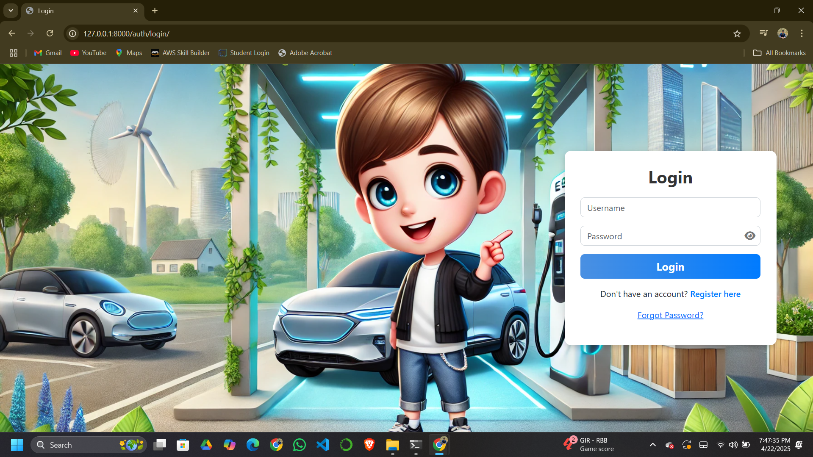
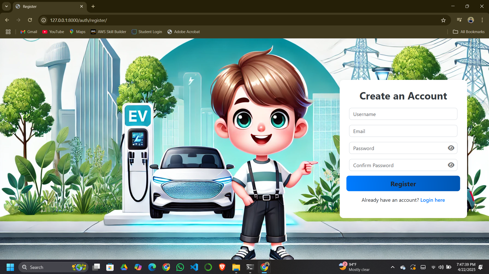
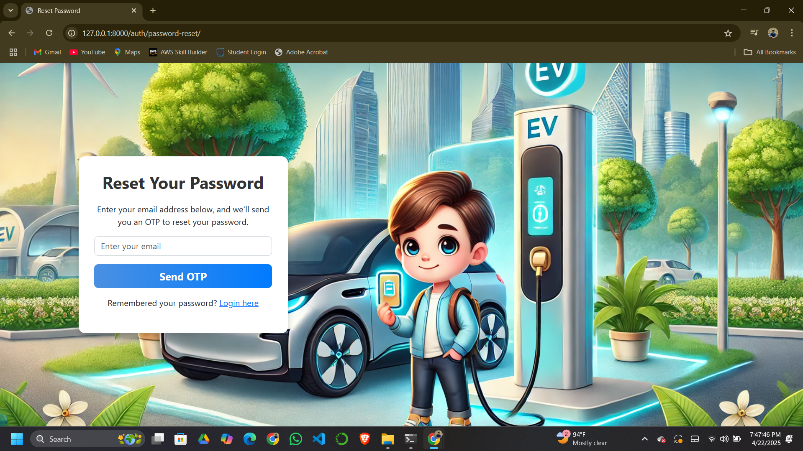
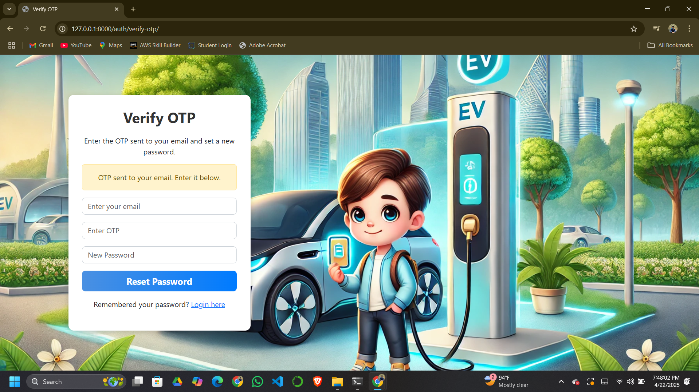
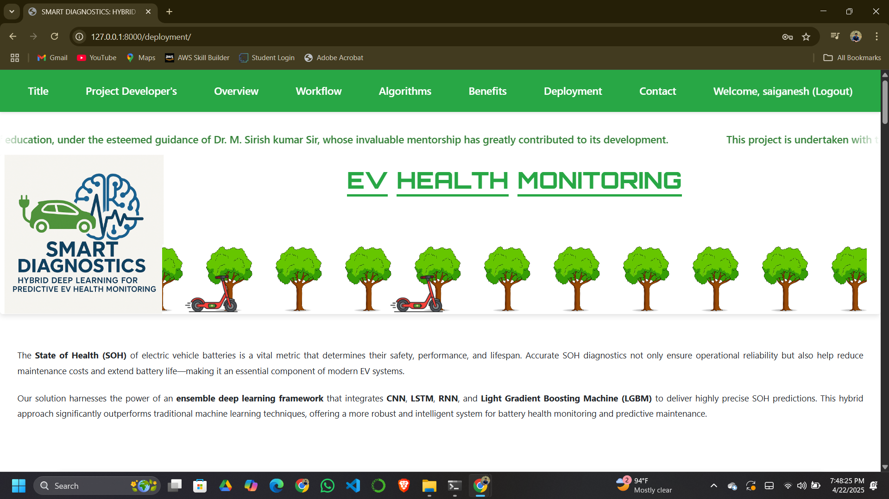

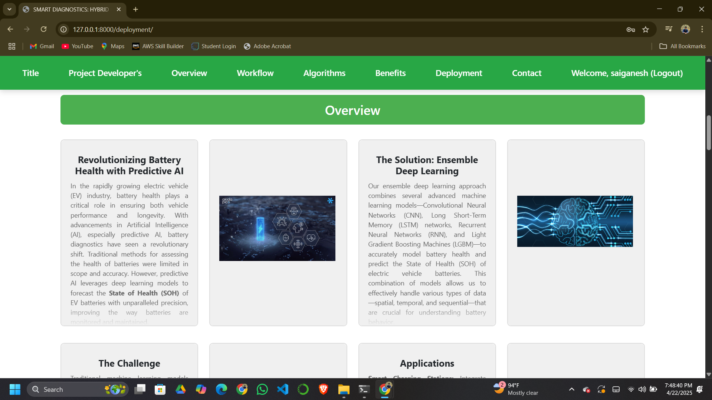
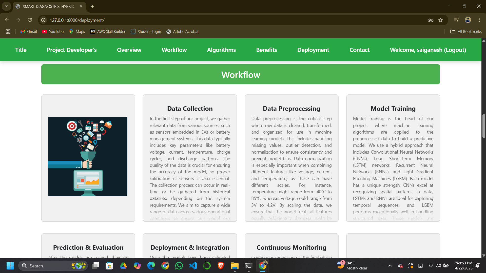
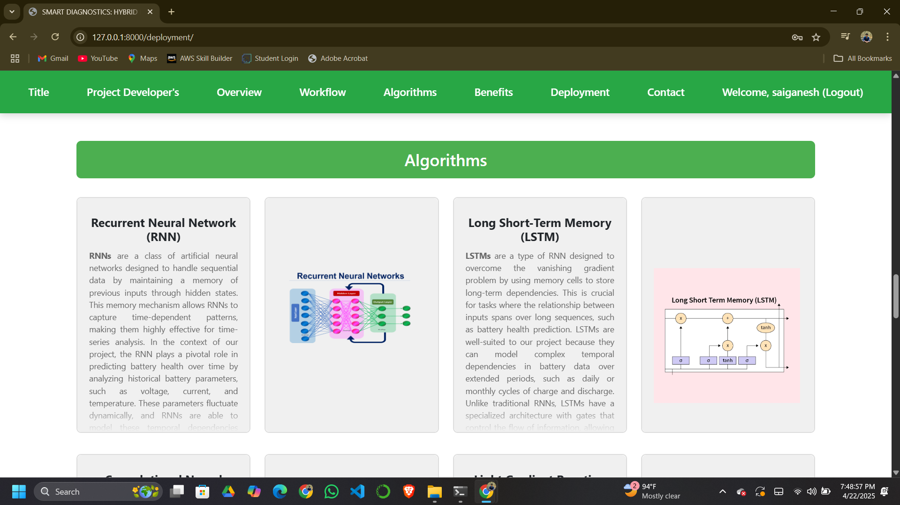
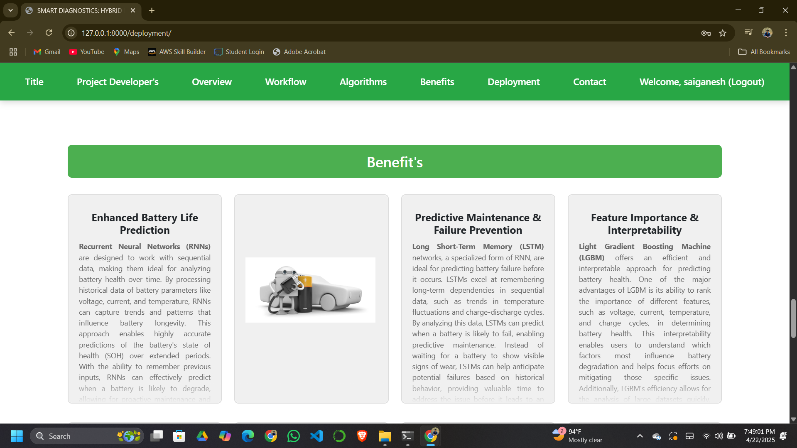
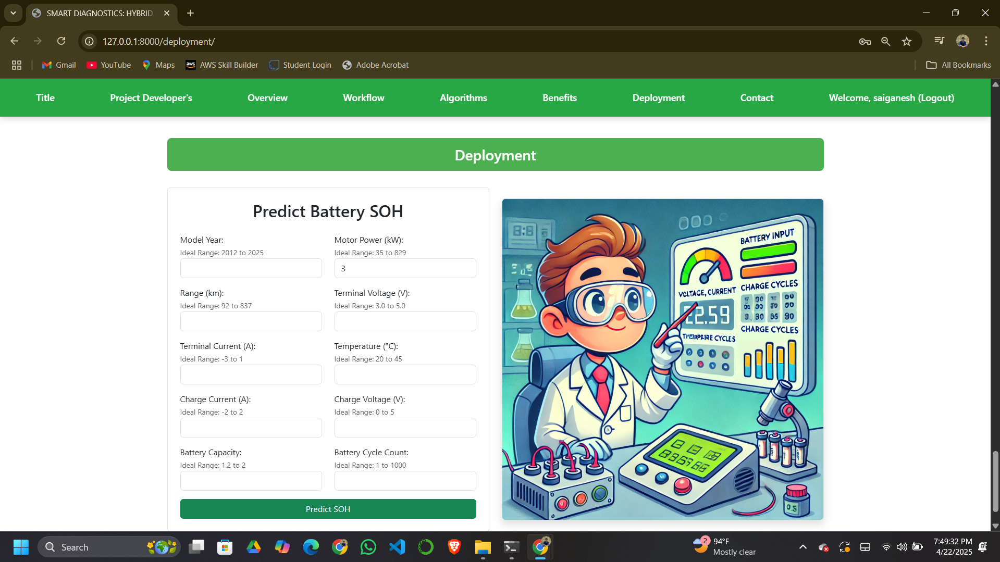
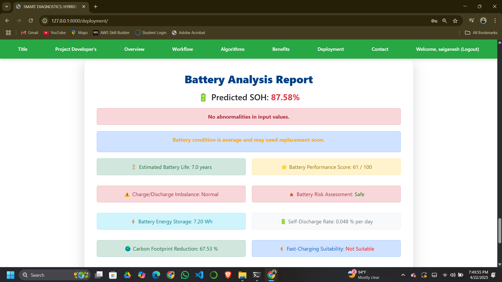
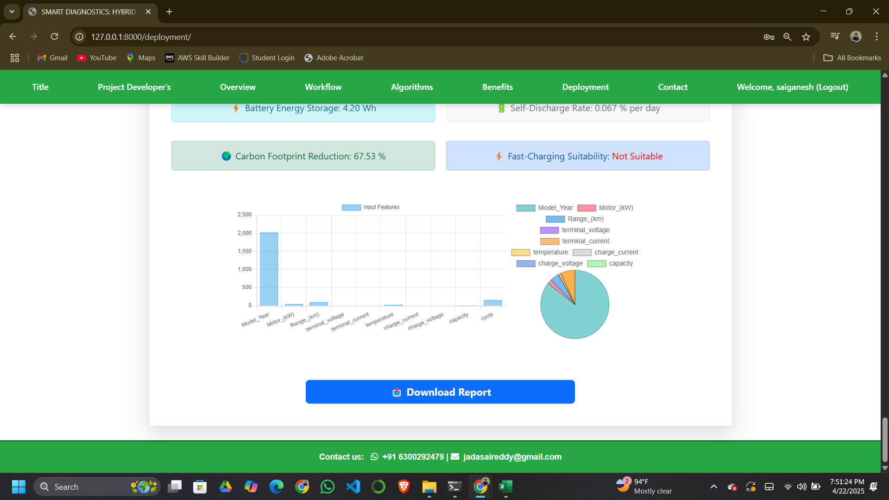


---

## 📬 Contact

- 👨‍💻 **Developer:** Sai Ganesh J  
- 📧 **Email:** [jadasaireddy@gmail.com](mailto:jadasaireddy@gmail.com)  
- 🔗 **GitHub:** [@jadasaiganesh](https://github.com/jadasaiganesh)

